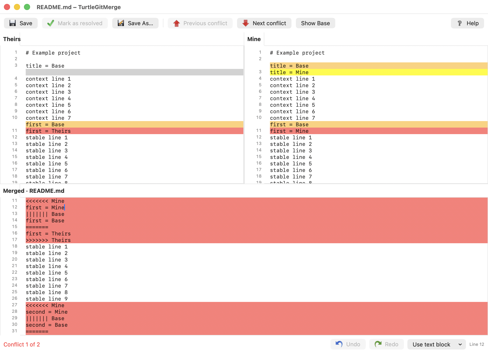

# TurtleGit for Mac

*A macOS fork of TortoiseGit*

A native macOS port in progress, based on the workflows and source inventory of
[TortoiseGit](https://github.com/TortoiseGit/TortoiseGit). This is an independent,
unofficial project. **The complete application has not been ported yet.**

SwiftUI and AppKit replace Windows/MFC windows. Git runs directly through Foundation
Process with argument arrays, literal pathspecs, and a serial repository actor.
A sandboxed Finder Sync extension uses shared cached status and opens native dialogs
through the `turtlegit:` URL scheme. Minimum deployment target: macOS 13.

## Build and run

Requires Xcode with its macOS SDK and command-line tools, plus Git. The generated
Xcode project is checked in; XcodeGen is optional unless changing `project.yml`.

```sh
swift test
./scripts/build.sh
open build/Build/Products/Debug/TurtleGitMac.app
```

For a quick app-only build: `swift run TurtleGitMac`. That does not bundle or
activate the Finder extension. The unsigned Xcode build verifies compilation and
bundle structure; it is not a signed distribution.

## Implemented first pass

Native historical Blame opens from Log with annotation columns, age colors,
revision/author highlighting, a modeless Find panel (Command-F), a native
Go To Line sheet (Command-L), origin-aware Show log and
Show changes and Blame previous revision with merge-parent choices, plus full log
clipboard details. UTF-8 and unambiguous UTF-16 LE/BE sources retain exact
historical bytes. An Encoding popup provides explicit UTF and installed legacy
code-page choices. Previous-revision Blame retains the applied encoding and
whitespace/move/copy options. Five upstream detection modes and separate within-file
and between-file character thresholds are available, along with first-parent
attribution through merges. Native Blame Settings and viewer controls save
annotation defaults for future windows. Font, tab width and separate light/dark
age-color settings are available; native font/tab persistence and alignment are
verified, while custom color selection and live updates still need acceptance.
An embedded revision Log provides Show complete log and Follow renames, with
upstream option dependencies and source-line focus. A right-hand Properties pane
shows author/committer metadata, full body and parents. A narrow source locator
shows whole-file age colors and the current viewport. Previous/Next change
actions scroll between blocks of selected revisions without wrapping. Full menus, syntax
highlighting and encoding parity remain pending. See [Blame parity](docs/BLAME-PARITY.md).

- Open normal repositories and linked worktrees; show branch and status.
- Remember recent repositories with security-scoped bookmarks; renew stale permissions
  and hold access for the session. Finder requests require an existing grant or a picker.
- Standalone Working Tree status window with upstream column/filter/action layout,
  original status icons, staged state, file statistics, dates, sorting and context menus.
  Scope, ignored/unversioned and index-flag filters; unified diff export.
- Stage / unstage selected paths, including before the first commit.
- Separate native Commit window with checked-file selection, message, amend, author,
  sign-off, file statistics and icon context menus. Enable staging area switches to
  three-state staging checkboxes and commits the index, preserving unstaged edits.
  An attached right-hand patch window stages/unstages selected lines or hunks in
  ordinary tracked UTF-8 text files. Restore after commit saves working contents and
  restores them after a successful commit, retaining the committed index/HEAD.
  Revert resets selected files and index entries, retaining replaced contents in
  macOS Trash and leaving added files unversioned. Commit’s Delete context command
  moves unversioned files to Trash and stages removal of missing tracked paths;
  a separate Shift confirmation supports permanent deletion. Mixed selections use
  the marked row to enable Delete; table-focused Delete keys preserve normal text
  editing. The clipboard submenu copies the clicked column with the original icon;
  Command-C copies relative paths and Shift-Command-C adds status. Double-click
  previews untracked files against an empty base without staging them. Compare two
  files opens the selected paths side by side, using working contents or pinned
  HEAD for a deleted side. Renamed paths
  and leading-dot extensions match the upstream display. Changelist creation,
  assignment, ignored-file checks and optional successful-commit cleanup are
  available, with status/changelist group headings and group check/unstage actions. Broader selection and
  signed sandbox checks remain under audit. Highlighted checkbox changes and Space
  apply to the highlight; F5 refreshes while retaining the message and checks.
  Index-flag menus use the marked file; mixed selections update indexed paths and
  report unavailable ones while preserving file contents.
- Dedicated Revert window with scoped file checks, Select/deselect all, counts,
  F5 refresh and light/dark appearance; Finder and app-menu routing.
  [Revert parity details](docs/REVERT-PARITY.md) record the remaining workflows.
- Separate three-pane Log Messages window: compact branch/merge graph, refs, full
  commit message, changed paths and added/removed line counts; search/date filters,
  all-branches and loading older commits; revision and working-tree comparisons.
  Full revision clipboard details include notes, tags and paths, with an option
  to omit changed paths and support for multiple selected revisions.
- Original TortoiseGit command icons in app context menus and the Finder submenu;
  original XPStyle status artwork for Finder badges and app file status.
- Log revision actions for branch/tag, Switch/Checkout, reset, revert without commit,
  cherry-pick, and copying hashes/messages/details. Advanced options remain pending.
- Commit’s file menu adds unversioned paths explicitly; Shift reveals upstream
  executable/symlink index-mode choices without modifying working-file contents.
  Checkbox Commit retains explicit staged modes while reading later working edits.
- Commit’s separate editor command uses TextEdit or a saved custom macOS app,
  configured in Settings → Alternative Editor, with the original editor icon.
- Commit file Export uses the original icon and a native folder chooser, preserving
  relative paths and exact working contents without staging or committing files.
- Ordinary file Diff from Finder requests, app menus, Commit and Working Tree routes to the
  native two-pane viewer, comparing HEAD with working contents including staged edits.
  Folder Diff opens Working Tree; Log changed-file comparisons and double-click
  also open native viewers. Unified/index diff inspection remains available.
  Explicit untracked files compare with an empty base without staging them. Commit
  comparisons follow the selected HEAD/first-parent amend mode.
  Log file-history actions open scoped native history; clipboard menus offer full
  paths, relative paths, names and displayed file information. Historical blob extraction
  is byte-preserving. Native Save As acceptance is verified for a committed text
  blob with BOM and CRLF while retaining different staged and working contents.
  Earlier intermittent panel failures and further export variants remain under
  investigation. Historical Open, Open With and alternative-editor commands use
  read-only temporary copies; native editor-document acceptance remains under audit.
  See [Log parity](docs/LOG-PARITY.md).
- Native three-pane UTF-8 text conflict editor with Theirs/Mine/Merged, block choices,
  aligned source rows and colors, original line numbers, undoable whole-source
  selection, Reload and guarded Save/Mark as resolved. Full editor parity and native QA
  remain in progress; see [Text merge parity](docs/TEXT-MERGE-PARITY.md).
  
- Native Merge window with branch/tag/commit selection, squash, fast-forward, No Commit,
  message summaries, strategy controls and custom messages. See [Merge parity](docs/MERGE-PARITY.md).
- Native Stash Save window with an optional message, mutually exclusive include-untracked
  and --all options, and the upstream Abort/Continue warning workflow.
  [Stash parity](docs/STASH-PARITY.md) records remaining work.
- Stash Apply/Pop run directly with native progress and success/conflict prompts.
  Yes opens Working Tree; failed Pop retains its stash for recovery.
- Native RefLog and Stash List window with upstream columns, reference selection,
  Find Next, selected Apply, inspection and guarded stash deletion/clear.
  [RefLog parity](docs/REFLOG-PARITY.md) records remaining work.
- Native Clone window with depth, recursion, bare/no-checkout, branch/origin,
  OpenSSH-key and SVN option groups, Retry and Log/Finder post-actions. Real Git and
  native shallow-branch clone checks pass; [Clone parity](docs/CLONE-PARITY.md)
  records remaining work.
- Native Create Repository window with the upstream Bare option, destination warnings
  and preserved existing contents. Bare repositories open in the workspace and Log;
  worktree-only actions are disabled. [Create Repository parity](docs/INIT-PARITY.md)
  records picker, signed integration and remaining native verification.
- Separate native Rebase window with ordered Pick/Skip/Edit/Squash actions, original
  action icons, branch/upstream/onto controls and lower file/message/progress tabs.
  Native Start/Skip selection and recovered Edit/Amend were exercised; full recovery
  UI remains pending; Pull/Fetch handoffs were verified. [Rebase parity](docs/REBASE-PARITY.md).
- Follow System, Light and Dark appearance choices, with upstream file-status colors
  and original colored artwork. [Appearance audit](docs/APPEARANCE.md).
- Native New Branch/Tag windows with HEAD/branch/tag/commit selectors, descriptions,
  annotated tag messages, force, remote tracking and optional branch checkout.
  Tag Push opens native Push options scoped to the new tag.
  [Branch/tag parity](docs/BRANCH-TAG-PARITY.md) tracks remaining options.
- Separate native Pull dialog with remote/branch selectors, squash, no commit,
  fast-forward controls, Tags/Prune and shallow depth.
  [Pull parity](docs/PULL-PARITY.md) records pending rebase and recovery workflows.
- Separate native Fetch dialog with named remote/all remotes or URL, remote branch
  browsing, three-state Tags/Prune overrides and shallow depth.
  [Fetch parity](docs/FETCH-PARITY.md) records remaining work.
- Separate native Push dialog with reference/destination selectors, force with lease,
  tags, upstream tracking, per-branch defaults, submodule recursion and server option.
  [Push parity](docs/PUSH-PARITY.md) records remaining work.
- Separate native Switch/Checkout dialog with branch/tag/commit selectors and
  create-branch, force, merge, three-state remote tracking and branch override.
  [Switch parity details](docs/SWITCH-PARITY.md) document pending chooser and UI work.
- Finder extension target with status badges, directory status aggregation,
  TurtleGit context submenu, and complete multi-selection URL dispatch. File/folder
  selections scope Diff and Log; Show Whole Project restores unfiltered history.
- Native Rename dialog with original context-menu artwork, versioned-file menus
  in Commit/Working Tree and Finder dispatch. Real Git tests preserve mixed changes
  and reject occupied/outside destinations. [Rename parity](docs/RENAME-PARITY.md).
- Native Delete / Delete (keep local) confirmation and per-item Ignore/Abort handling,
  original artwork and Finder dispatch. Retained copies survive selective commits
  and amendments. [Delete parity](docs/REMOVE-PARITY.md) tracks remaining QA.
- Native Ignore dialog with upstream scope/destination radios, name/extension rules,
  per-folder and linked-worktree excludes, original artwork and Delete-and-ignore
  keep-local prompts. [Ignore parity](docs/IGNORE-PARITY.md) records remaining QA.
- Native Resolve checked list and current/mine/theirs actions with original artwork,
  scoped conflicts and rebase-aware labels. [Resolve parity](docs/RESOLVE-PARITY.md)
  records verification and the remaining conflict editor/submodule work.
- Dedicated native Reset dialog with Branch/Tag/Commit, Soft/Mixed/Hard and
  submodule resolution handoff. [Reset parity](docs/RESET-PARITY.md) records the
  verified Git effects and remaining native/progress work.
- Native delete/modify Conflict dialog with Modified/Created, Delete and default
  Abort, side history and base comparison. [Conflict parity](docs/DELETE-CONFLICT-PARITY.md)
  records native keep behavior and remaining editor/QA work.
- Upstream file and dialog inventories pinned to an exact commit.

These are initial workflows, not full upstream parity. The operation dialogs expose
only the options shown. [Log parity details](docs/LOG-PARITY.md) track the upstream
controls and context commands still missing. Checkbox mode commits the current
whole-file contents of checked paths; staging mode commits **all** staged changes,
including files outside the current view. Highlighted rows do not select commit
contents. [Commit parity details](docs/COMMIT-PARITY.md) track remaining options. Authentication uses existing credential helpers / SSH configuration; there is
no native credential prompt yet. Interactive hooks, Git editors, signing prompts,
cancellation and live streaming progress are not implemented. Conflicts remain
visible in the status list. Regular UTF-8 text conflicts can be resolved in the
native three-pane editor; unsupported formats still require another tool. The
merged result offers the upstream nine-style line-ending conversion submenu
with Undo/Redo. Full encoding and diff/merge parity remain in progress.

The future [user manual](docs/MANUAL-PLAN.md) follows TortoiseGit’s structure and
terminology with macOS-specific instructions and real TurtleGit screenshots.

## App Store target

The `TurtleGitAppStore` scheme provides a separate sandboxed configuration.
It requires the pinned bundled Git runtime and never falls back to system Git.
Build it with `python3 scripts/build-git-runtime.py` before the AppStore target.
Signed sandbox tests and GPL/App Store terms clearance remain open.
See [distribution engineering](docs/DISTRIBUTION.md) and [privacy](docs/PRIVACY.md).
This is not an App Store-ready release.

## Finder extension

Open `TurtleGitMac.xcodeproj` in Xcode. Configure your signing team on the app,
framework and extension targets. Register an App Group supported by your signing
team; replace `group.org.turtlegit.macos` in **both** entitlements and
`FinderIntegration.group` if necessary. Keep the containing app and extension
signed with matching group access. Build and launch the app, then enable
**TurtleGit Finder** in System Settings' extension controls (location depends on
macOS version). Open a repository in the app to register its monitored folder.

The extension compiles and is embedded in the application. End-to-end activation
and badge rendering require a signed install and have not been verified here.
Finder Sync controls badge placement and menu insertion; it cannot reproduce
Explorer's shell extension APIs directly. Badges apply to registered repository
folders rather than the entire disk. Repositories are cached when opened, and only
the current repository refreshes every five seconds while the app is running.
Cached inactive/closed repository statuses can be stale. Selections spanning repositories are rejected before an operation runs.
The independent background cache, FSEvents invalidation, repository management and conflict
with other Finder extensions still need implementation and testing.

## Complete port tracking

[`docs/UI-PARITY.md`](docs/UI-PARITY.md) records the required source, layout and
behavior comparisons for every native replacement.

[`docs/PORTING.md`](docs/PORTING.md) describes component replacements and remaining
work. [`docs/upstream-files.csv`](docs/upstream-files.csv) includes every tracked
upstream entry with its blob hash and review status.
[`docs/upstream-dialogs.csv`](docs/upstream-dialogs.csv) inventories native dialog
resources. Being listed does not mean being ported.

```sh
git clone --depth 1 https://github.com/TortoiseGit/TortoiseGit.git .upstream/TortoiseGit
git -C .upstream/TortoiseGit fetch origin 7338078f8ddd924b8cddee35f512f2286072136d
git -C .upstream/TortoiseGit checkout 7338078f8ddd924b8cddee35f512f2286072136d
python3 scripts/inventory-upstream.py
```

The upstream checkout is ignored, not vendored. Regeneration preserves existing
file decisions and marks changed blobs for review. External libraries and gitlinks
are inventoried but their nested repositories are not recursively audited.

## License

GPL v2, matching upstream TortoiseGit; see `LICENSE` and `NOTICE`. The development application
currently uses Apple's frameworks and the installed Git executable, with no copied
upstream binaries or bundled third-party libraries.

## Screenshots and project website

[Visit the project website](https://jfk-solutions.github.io/turtle-git-mac/).


Screenshots use only disposable sample data. The static GitHub Pages source is in
`docs/site`; `python3 scripts/build-site.py` builds `build/site`. The deployment
workflow uses the current repository name for source links, including after a rename.
See [website and screenshot maintenance](docs/WEBSITE.md).

Fetch can now open a native Rebase plan for its selected branch. A rebase-configured
Pull follows Fetch → Rebase and starts automatically; see
[Rebase parity](docs/REBASE-PARITY.md) for verified behavior and remaining differences.

The native submodule Conflict chooser now shows checkout-based Base and destination
revision/subject/type details, with side history and Use this choices.
[Submodule Diff and Changed Files parity](docs/SUBMODULE-DIFF-PARITY.md) records
the native comparison windows, immutable revision comparisons, post-Revert
submodule handling, the native Base/Theirs file viewer and remaining comparison
actions. File double-click opens colored, aligned panes with Find and difference
navigation; unified patch is available separately. The two-file viewer
supports explicit working-file editing and guarded Save; historical sides stay
read-only. Use other block/file, both block orders, Undo/Redo and pane-specific
Save As are available. Pane context menus also apply selected line ranges and
offer Copy/Cut/Paste with alignment gaps excluded. Mark/Unmark and Leave only
marked blocks preserve marked and manually edited lines, with original gutter
icons and Undo. Inline character/word differences use the upstream light/dark
colors and missing-text markers; normal Log comparisons open Changed Files.
Full TortoiseMerge parity remains in progress.
[Submodule Update parity](docs/SUBMODULE-UPDATE-PARITY.md) records the native
selection/options window, real Git behavior and remaining progress/Finder checks.

[Submodule conflict parity](docs/SUBMODULE-CONFLICT-PARITY.md) records remaining
edge cases and native QA. The Git integration suite runs in CI. Submodule deletion offers Delete/Abort
and preserves the complete checkout in macOS Trash. Monochrome Log, Help and
cherry-pick icons adapt to light/dark appearances.

Log's selected-file menu supports historical folder Export with original artwork,
subfolders and pinned committed bytes. Native export, Ignore/Abort and chooser
Cancel preserve repository state; overwrite and signed sandbox checks remain
pending. Reveal in Finder selects the current disk item or opens its nearest
existing parent when the historical path is absent, without checking out a file.
Both native reveal routes were verified.

Mark for comparison retains a path and revision within the Log dialog. Compare
with opens a read-only viewer for the same path at another revision or a different
historical path. Both native routes were verified with exact repository state
preserved. External working-file marks, gitlinks and long-path menu-label
compaction remain under audit.

Working-file marks persist across app launches and compare files in separate
locations through the native viewer. App and Finder request routes are wired;
a persisted-mark request and editing toggle were verified natively. Finder
extension clicks, direct menu chooser handoff and signed sandbox checks remain
pending. See [comparison mark parity](docs/COMPARISON-MARK-PARITY.md).

Compare two files uses the selected commit's first parent independently for
deleted sides. Multi-file unified diff appends patches in displayed order and
includes both names of a rename. Core regressions pass; native pair and multi-file
patch acceptance, merge-parent variants and signed sandbox checks remain pending.
See [Log parity](docs/LOG-PARITY.md) for source audits and verification limits.
