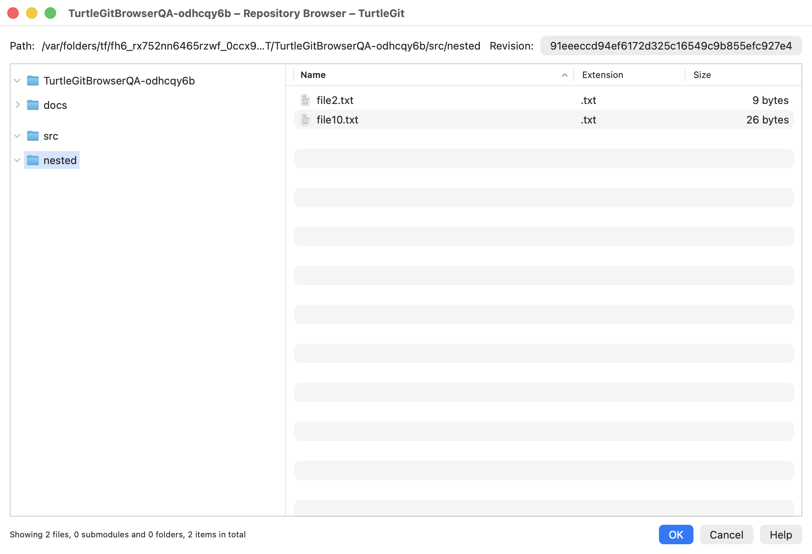
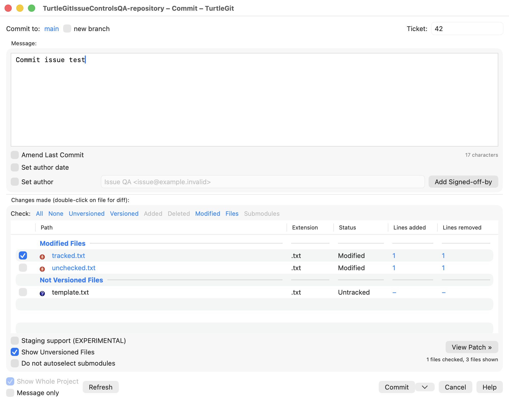
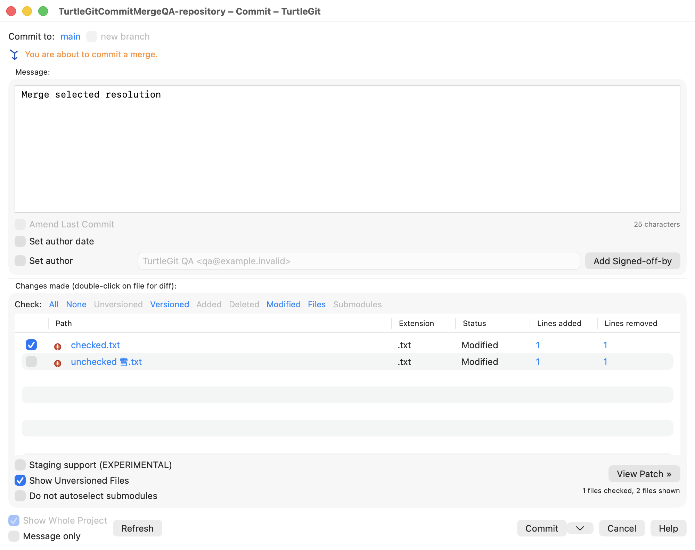
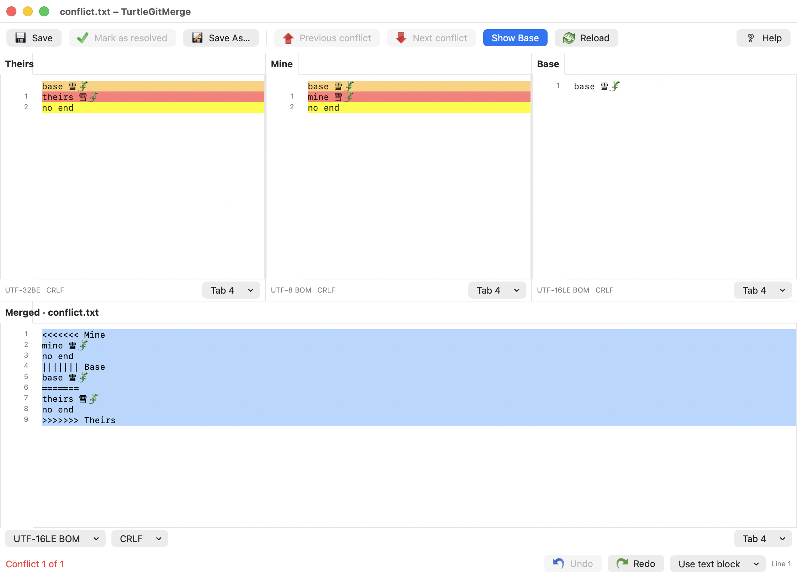
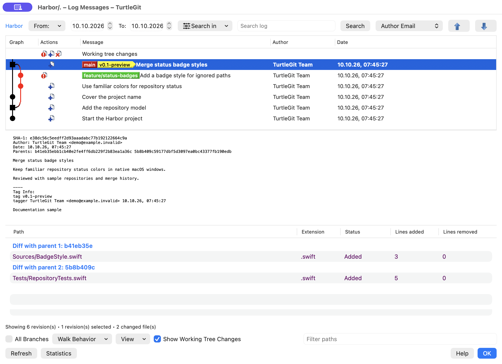

# TurtleGit for Mac

*A macOS fork of TortoiseGit*

A native macOS port in progress, based on the workflows and source inventory of
[TortoiseGit](https://github.com/TortoiseGit/TortoiseGit). This is an independent,
unofficial project. **The complete application has not been ported yet.**

SwiftUI and AppKit replace Windows/MFC windows. Git runs directly through Foundation
Process with argument arrays, literal pathspecs, and a serial repository actor.
A sandboxed Finder Sync extension uses shared cached status and opens native dialogs
through the `turtlegit:` URL scheme. Minimum deployment target: macOS 13.

## Build and run

Requires Xcode with its macOS SDK and command-line tools, plus Git. The generated
Xcode project is checked in; XcodeGen is optional unless changing `project.yml`.

```sh
python3 scripts/build-editorconfig-runtime.py
python3 scripts/build-issue-regex-runtime.py
swift test
./scripts/build.sh
open build/Build/Products/Debug/TurtleGitMac.app
```

For a quick app-only build: `swift run TurtleGitMac`. That does not bundle or
activate the Finder extension or embed the EditorConfig and issue-matching helpers; use the Xcode
build for those features. The unsigned Xcode build verifies compilation and
bundle structure; it is not a signed distribution.

See [testing](docs/TESTING.md) for the CI receiver sequence, Git compatibility
checks, process cleanup and verification limits.

## Implemented first pass

Native Add now uses the upstream file-only progress route and folder checked-list
route, with Include ignored files, original icons and checked-only forced staging.
The cancellable private-index transaction preserves unrelated staging. Progress
provides Commit and executable/symlink post-actions that preserve the staged blob
when the working file has since changed or disappeared. Add's status menu now
includes tracked history, old-name history, HEAD Blame, base comparison and
two-file comparison, plus read-only unified diff with per-file statistics and
configured external/alternate viewer routing. If a selected file disappears before comparison, that side
uses pinned HEAD contents without changing the working tree or index. The menu
also provides native Open With, the configured alternative editor, and clipboard
commands for paths, names, extensions, all visible columns and the right-clicked
column. Its Ignore commands
open the native name/extension/folder rule dialog and refresh the Add list while
preserving unrelated checks and the Git index. Delete now uses a native
confirmation, recoverable Trash by default, and Shift for permanent deletion;
stale selections are rejected before deletion. Save As and Export copy current
working contents with binary bytes and relative folder layout preserved; the
index is unchanged. The shared Restore after commit command now saves temporary
working copies, shows the original row overlay and offers confirmed restoration
without changing staged contents. Copies last for the Add dialog's lifetime.
Add Revert now uses the source confirmation rule and shared cancellable progress,
with added-file preservation, Trash recovery and checked-list refresh.
Original translucent Add artwork now appears in both lists;
progress follows the upstream Action/Path columns.
[Add parity](docs/ADD-PARITY.md) records unfinished menus, post-actions and native QA.

Create Patch Serial now has a native Format Patch dialog with Since, Number
Commits and Range choices, no-prefix output, history fields, Log pickers and a
read-only unified-diff viewer. The repository export has binary patch round-trip
tests; native interaction, mail handoff and signed sandbox acceptance remain
unverified. See [Format Patch parity](docs/FORMAT-PATCH-PARITY.md).

Log's Format Patch command presets Since for one selected revision or an inclusive
Range for multiple revisions, using the original patch icon. Selection rules and
generated patch subjects are tested; native activation remains unverified.

Format Patch cancellation now stops its owned Git process group and preserves
partial patches and diagnostics. Process tests verify leader/child cleanup;
native Cancel/Escape interaction and signed sandbox behavior remain unverified.

Unified Diff Viewer settings preserve an external application independently of
Alternative Editor. Shift reverses the saved viewer choice for Format Patch and
Log revision/selected-file, Commit, Working Tree and Changed Files unified diffs. Preference rules and exact read-only
preview bytes, including non-UTF-8 Git patches, are tested;
native launching and signed handoff remain unverified. See
[viewer parity](docs/UNIFIED-DIFF-VIEWER-PARITY.md).

Built-in Log, Commit and Working Tree unified diffs now share the colored patch
viewer with Find and Save As (Command-Shift-S). Read-only patch windows retain
original bytes for Save As, including non-UTF-8
content, BOMs and line endings. Working Tree’s native toolbar/keyboard Save As,
Cancel and exact UTF-8 export are verified, with an [actual screenshot](docs/site/assets/unified-diff-viewer-light.png).
Other routes, native non-UTF-8 exports and signed sandbox acceptance remain unverified.

The unified viewer now has appearance settings for all six foreground/background
color pairs, separate light/dark palettes, font and tab sizes, and restoring the
selected palette. Defaults follow TortoiseUDiff, with Menlo as the native font.
Focused persistence/style tests pass. Native settings navigation and all twelve
color wells are verified; full layout and live Apply acceptance remain pending. The screenshot above predates these appearance changes.

Unified diffs now offer Print through Command-P, toolbar and context menu, with
whole-diff/selected-text choices in a native print sheet. Snapshot isolation and
actual selected-text and paginated whole-diff PDF output are verified;
Native File-menu Save As/Print, print-sheet Cancel, selection defaults and
whole-diff toggling are verified. Signed printer acceptance remains pending.

Unified Diff's Page Setup now saves four locale-aware margins with TortoiseUDiff's
one-inch defaults. Native validation, Cancel and save/reopen are verified. PDF
checks confirm saved margins affect pagination; physical printer and signed
sandbox acceptance remain pending.

Repository Browser now has the upstream folder tree, revision picker, sortable
Name/Extension/Size list and historical file menus with original command and mode
icons. It browses pinned nested revisions, including bare repositories and tags,
and compares marked files across revisions without checking them out. Revert to
this revision restores selected ordinary files into the index and working tree,
with per-file Continue/Cancel errors. Gitlinks provide separate parent and child
history; child Log uses the displayed gitlink rather than its current HEAD.
Historical file/folder drag representations are now provided by the table and
folder tree, with native file/folder receiver checks. Actual Finder drops, broader submodule acceptance,
broader native acceptance and signed integration remain pending.
See [Repository Browser parity](docs/REPOSITORY-BROWSER-PARITY.md).



Native historical Blame opens from Log with annotation columns, age colors,
revision/author highlighting, a modeless Find panel (Command-F), a native
Go To Line sheet (Command-L), origin-aware Show log and
Show changes and Blame previous revision with merge-parent choices, plus full log
clipboard details. UTF-8 and unambiguous UTF-16 LE/BE sources retain exact
historical bytes. An Encoding popup provides explicit UTF and installed legacy
code-page choices. Previous-revision Blame retains the applied encoding and
whitespace/move/copy options. Five upstream detection modes and separate within-file
and between-file character thresholds are available, along with first-parent
attribution through merges. Native Blame Settings and viewer controls save
annotation defaults for future windows. Font, tab width and separate light/dark
age-color settings are available; native font/tab persistence and alignment are
verified, while custom color selection and live updates still need acceptance.
An embedded revision Log provides Show complete log and Follow renames, with
upstream option dependencies and source-line focus. A right-hand Properties pane
shows author/committer metadata, full body and parents. A narrow source locator
shows whole-file age colors and the current viewport. Previous/Next change
actions scroll between blocks of selected revisions without wrapping. Full menus, syntax
highlighting and encoding parity remain pending. See [Blame parity](docs/BLAME-PARITY.md).

- Open normal repositories and linked worktrees; show branch and status.
- Remember recent repositories with security-scoped bookmarks; renew stale permissions
  and hold access for the session. Finder requests require an existing grant or a picker.
- Standalone Working Tree status window with upstream column/filter/action layout,
  original status icons, staged state, file statistics, dates, sorting and context menus.
  Scope, ignored/unversioned and index-flag filters; unified diff export.
- Stage / unstage selected paths, including before the first commit.
- Separate native Commit window with checked-file selection, message, amend, author,
  sign-off, file statistics and icon context menus. Enable staging area switches to
  three-state staging checkboxes and commits the index, preserving unstaged edits.
  Checked-file mode now completes resolved merges, cherry-picks and reverts using
  the selected tree, retaining operation metadata and unchecked index entries.
  The configured issue-ID field uses TortoiseGit's top-right layout, repository/
  `.tgitconfig` precedence, numeric validation, issue-line insertion and ordered
  missing-issue/template/sign-off warnings. Native cancellation and checked-file
  commit acceptance preserve unchecked changes. Configured tracker links use
  bold/italic message highlights in both appearances; Recent messages updates
  the issue field using upstream rules. Ordinary URLs and email addresses use
  the upstream punctuation/bracket scanner and native links. Per-line `*bold*`,
  `^italic^` and `_underlined_` marker formatting follows upstream precedence, with
  a saved Style commit messages preference. Filename completion includes displayed
  unchecked files and path suffixes, with Ctrl-Space, original file icons and
  saved enable/minimum/extension preferences. Shipped/user snippet definitions
  expand multiline text with original snippet icons, source escape rules and Undo.
  Code-symbol completion scans displayed files using shipped/private definitions,
  with source size/time gates and snippet priority. Windows decoder equivalence,
  complete editor behavior and spelling remain pending; see [code-symbol audit](docs/COMMIT-CODE-SYMBOL-PARITY.md).
  Provider plugins and signed scope
  acceptance remain pending; see [issue audit](docs/ISSUE-TRACKER-PARITY.md).
  
  
  An attached right-hand patch window stages/unstages selected lines or hunks in
  ordinary tracked UTF-8 text files. Restore after commit saves working contents and
  restores them after a successful commit, retaining the committed index/HEAD.
  Revert resets selected files and index entries, retaining replaced contents in
  macOS Trash and leaving added files unversioned. Commit’s Delete context command
  moves unversioned files to Trash and stages removal of missing tracked paths;
  a separate Shift confirmation supports permanent deletion. Mixed selections use
  the marked row to enable Delete; table-focused Delete keys preserve normal text
  editing. The clipboard submenu copies the clicked column with the original icon;
  Command-C copies relative paths and Shift-Command-C adds status. Double-click
  previews untracked files against an empty base without staging them. Compare two
  files opens the selected paths side by side, using working contents or pinned
  HEAD for a deleted side. Renamed paths
  and leading-dot extensions match the upstream display. Changelist creation,
  assignment, ignored-file checks and optional successful-commit cleanup are
  available, with status/changelist group headings and group check/unstage actions. Broader selection and
  signed sandbox checks remain under audit. Highlighted checkbox changes and Space
  apply to the highlight; F5 refreshes while retaining the message and checks.
  Index-flag menus use the marked file; mixed selections update indexed paths and
  report unavailable ones while preserving file contents.
- Dedicated Revert window with scoped file checks, Select/deselect all, counts,
  F5 refresh and light/dark appearance; Finder and app-menu routing.
  [Revert parity details](docs/REVERT-PARITY.md) record the remaining workflows.
- Optional [Gravatar author pictures](docs/GRAVATAR.md) in Log, with repository-specific visibility, custom provider URL, SHA-256/MD5 and cancellable cached loading.
- [Compressed graph expansion](docs/LOG-GRAPH.md) with per-commit Expand/Collapse and hollow collapsed nodes.
- Separate three-pane Log Messages window: compact branch/merge graph, refs, full
  commit message, lazy colored Actions icons, changed paths and added/removed line
  counts; search/date filters,
  all-branches and loading older commits; revision and working-tree comparisons.
  Optional email/committer/date columns and a header menu support saved visibility,
  resizing/reordering and resetting columns. Settings → Dialogs offers short/long,
  relative and system-locale date display, with absolute tooltips for relative dates.
  The upstream Jump dropdown navigates emails, merges, parents, tags, branches
  (including fast-forward ancestry) and a 50-entry selection history.
  Refreshing or closing Log cancels its owned history, changed-file and clipboard
  detail reads.
  Search offers saved Subject/Message/Paths/Author/Email/Revision/Refname/Tag Info/Notes
  choices and configured Bug IDs, with a matching issue column. All/Toggle filters,
  case sensitivity, plain term/exclusion/phrase queries and ECMAScript regex mode
  are implemented. Author and email searches
  include committer identities; the message pane also shows commit notes and annotated tag information. [Log parity details](docs/LOG-PARITY.md) describe
  the remaining search modes and native acceptance checks.
  Full revision clipboard details include notes, tags and paths, with an option
  to omit changed paths and support for multiple selected revisions. Author and
  tagger dates use the Log preferences in the message pane and copied details;
  tag-info searches include the formatted tagger date. Single revisions offer
  [Edit Notes](docs/GIT-NOTES.md), with exact text preservation and project minimum
  message length; [parity details](docs/EDIT-NOTES-PARITY.md) record remaining checks.
  [Revert from Log](docs/REVERT-COMMIT.md) offers merge-parent choices and the
  upstream confirmation/result prompts, with a Commit handoff.
- [Log statistics](docs/STATISTICS.md) has a native dialog over the shown
  revision snapshot, author/date choices, lazy file/line calculation and five chart
  styles with the original graph icons. Options and the last graph page are saved.
  Save Graph As exports PDF, PNG, JPEG, BMP and GIF; displayed/signed acceptance
  remains pending.
- [Clean](docs/CLEAN-PARITY.md) has native cleanup type/directory/Trash/dry-run/
  Submodules options, remembered repository preferences and a separate progress
  window with live item progress, Retry and dry-run actions. App commands and Finder's “Clean up…”
  entry retain selected folder scopes and use the original cleanup icon. Real
  Trash/permanent cleanup and cancellation are tested; activated Finder handoff,
  external sandbox grants and displayed/signed acceptance remain pending.
- Original TortoiseGit command icons in app context menus and the Finder submenu;
  original XPStyle status artwork for Finder badges and app file status.
  Advanced Settings → ShowAppContextMenuIcons controls app menu artwork while
  retaining button and status icons. ShowContextMenuIcons separately controls
  Finder artwork through the shared cache; signed handoff remains unverified;
  see [context-menu icon audit](docs/CONTEXT-MENU-ICONS-PARITY.md).
  Finder file/folder, added/unchanged and selection-count conditions now follow
  the implemented upstream command clauses; full classification remains pending.
  See [path-condition audit](docs/FINDER-PATH-CONDITIONS-PARITY.md).
  Finder two-file Diff now compares the ordered selected working files directly,
  including files outside repositories, with independent retained grants.
  [Two-file Diff audit](docs/FINDER-TWO-FILE-DIFF-PARITY.md) records native/signed gaps.
  Refreshed registered submodule roots now expose Rename/Remove and route them
  through the parent repository; [submodule root audit](docs/FINDER-SUBMODULE-ROOT-PARITY.md)
  records cache and signed-permission gaps.
  Parent refresh now collects initialized nested submodule caches without opening
  each child. [Cache-tree audit](docs/FINDER-SUBMODULE-TREE-PARITY.md) records
  deinitialization cleanup, retained independent roots and remaining background work.
  Finder folder creation menus and a toolbar entry point route Clone/Create
  repository to native dialogs/pickers. Targetless toolbar requests are supported;
  signed activation remains unverified. See [creation audit](docs/FINDER-CREATION-PARITY.md).
  Finder commands retain the menu's file/folder selection through activation,
  including container and nested Ignore entries; see [selection audit](docs/FINDER-SELECTION-PARITY.md).
  Implemented Finder commands follow upstream order and separator groups;
  Worktrees → Add opens New Worktree. Full conditions/coverage remain pending;
  see [menu layout audit](docs/FINDER-MENU-LAYOUT-PARITY.md).
  Cached bare/merge/bisect/stash/submodule facts now filter repository commands;
  see [metadata audit](docs/FINDER-REPOSITORY-METADATA-PARITY.md). Full path
  conditions, fresh background monitoring and signed handoff remain pending.
- Log revision actions for branch/tag, Switch/Checkout, reset, revert without commit,
  cherry-pick, and copying hashes/messages/details. Advanced options remain pending.
- Commit’s file menu adds unversioned paths explicitly; Shift reveals upstream
  executable/symlink index-mode choices without modifying working-file contents.
  Checkbox Commit retains explicit staged modes while reading later working edits.
- Commit’s separate editor command uses TextEdit or a saved custom macOS app,
  configured in Settings → Alternative Editor, with the original editor icon.
- Commit file Export uses the original icon and a native folder chooser, preserving
  relative paths and exact working contents without staging or committing files.
- Ordinary file Diff from Finder requests, app menus, Commit and Working Tree routes to the
  native two-pane viewer, comparing HEAD with working contents including staged edits.
  Folder Diff opens Working Tree; Log changed-file comparisons and double-click
  also open native viewers. Unified/index diff inspection remains available.
  Explicit untracked files compare with an empty base without staging them. Commit
  comparisons follow the selected HEAD/first-parent amend mode.
  Log file-history actions open scoped native history; clipboard menus offer full
  paths, relative paths, names and displayed file information. Historical blob extraction
  is byte-preserving. Native Save As acceptance is verified for a committed text
  blob with BOM and CRLF while retaining different staged and working contents.
  Earlier intermittent panel failures and further export variants remain under
  investigation. Historical Open, Open With and alternative-editor commands use
  read-only temporary copies; native editor-document acceptance remains under audit.
  See [Log parity](docs/LOG-PARITY.md).
- Native three-pane Unicode text conflict editor with Theirs/Mine/Merged, block choices,
  aligned source rows and colors, original line numbers, undoable whole-source
  selection, Reload, explicit output encodings and guarded Save/Mark as resolved. Full editor parity and native QA
  remain in progress; see [Text merge parity](docs/TEXT-MERGE-PARITY.md).
  
- Native Merge window with branch/tag/commit selection, squash, fast-forward, No Commit,
  message summaries, strategy controls and custom messages. See [Merge parity](docs/MERGE-PARITY.md).
- Native Stash Save window with an optional message, mutually exclusive include-untracked
  and --all options, and the upstream Abort/Continue warning workflow.
  [Stash parity](docs/STASH-PARITY.md) records remaining work.
- Stash Apply/Pop run directly with native progress and success/conflict prompts.
  Yes opens Working Tree; failed Pop retains its stash for recovery.
- Native RefLog and Stash List window with upstream columns, reference selection,
  Find Next, selected Apply, inspection and guarded stash deletion/clear.
  [RefLog parity](docs/REFLOG-PARITY.md) records remaining work.
- Native Clone window with depth, recursion, bare/no-checkout, branch/origin,
  OpenSSH-key and SVN option groups, Retry and Log/Finder post-actions. Real Git and
  native shallow-branch clone checks pass; [Clone parity](docs/CLONE-PARITY.md)
  records remaining work.
- Native Create Repository window with the upstream Bare option, destination warnings
  and preserved existing contents. Bare repositories open in the workspace and Log;
  worktree-only actions are disabled. [Create Repository parity](docs/INIT-PARITY.md)
  records picker, signed integration and remaining native verification.
- Log revision context menus now hand Merge/Rebase selections to native dialogs
  with original icons, branch/tag/hash presets and fresh state checks.
  [Log Merge/Rebase](docs/LOG-MERGE-REBASE.md).
- Bisect has a native two-field start window with editable references and Log
  pickers, Stash/Abort, original continuation icons and recoverable Git progress.
  Finder Start/Good/Bad/Skip/Reset now use fresh session state and original icons.
  Submodule Update availability follows each checkout and requires successful,
  idle progress.
  Log revision menus provide two-row Start, selected Good/Bad and multi-Skip.
  Participating modal Log pickers refresh after Bisect results and detach on close.
  The Log working-tree row now supports comparisons, Commit and current-commit
  Bisect Good/Bad/Skip/Reset, plus Stash/Pull/Fetch/Submodule Update handoffs.
  Selected versioned files support unified diff against HEAD with rename paths,
  raw patch bytes and alternate viewer handoff.
  Working-file Open/Open With/editor use the actual disk file; Save As and
  Export copy current bytes, including unversioned files.
  Two-file comparison uses HEAD for missing disk sides. Prepared comparison
  supports working/historical files in either direction and retained Finder marks.
  Working-row Blame annotates a freshly pinned HEAD, matching upstream;
  new/unversioned files are excluded.
  Conflicted working files offer Edit Conflict and Resolved/Mine/Theirs through
  existing native editors and Resolve; single-file primary action opens the editor.
  Advanced working-file actions and displayed/signed
  acceptance remain pending.
  [Bisect parity](docs/BISECT-PARITY.md).
- Log revision Export now opens a native ZIP/revision/Whole Project dialog and
  uses Git archive with overwrite confirmation. Repository and Finder folder/bare
  entry points share the dialog. Signed sandbox and displayed
  verification remain pending. [Revision Export](docs/REVISION-EXPORT.md).
- Separate native Rebase window with ordered Pick/Skip/Edit/Squash actions, original
  action icons, branch/upstream/onto controls and lower file/message/progress tabs.
  Multiple selected rows move together, with Shift-to-end and focused-list action
  shortcuts checked through a headless native receiver. Squash groups pause for
  multiline message approval and apply the first/latest/current author-date setting.
  [Squash workflow](docs/REBASE-SQUASH.md). Edit uses multiline approval, and Split
  reuses full Commit selection with partial-history recovery. Cancelling an
  unstarted Split preserves an applied conflict Edit pause and its message.
  [Edit/Split workflow](docs/REBASE-SPLIT.md). Conflict Files now retains resolved
  changes and routes native conflict editors and Resolve commands. Pick/Edit
  Continue commits checked files and recovers remaining changes through native
  Commit amendment sheets. Squash conflicts list the whole group and continue
  through combined-message approval. Empty groups offer Commit/Skip/Cancel with
  recoverable Skip, including linked worktrees. Configured Git reference updates follow group results and original rows through repeated Add. Repeated conflicts preserve all group messages; checkbox acceptance remains pending. [Squash conflicts](docs/REBASE-SQUASH-CONFLICTS.md).
  [Conflict workflow](docs/REBASE-CONFLICT-FILES.md). Empty Pick/Edit results offer
  Commit/Skip/Cancel, and conflict-message hints offer Ignore/Abort.
  [Empty-result workflow](docs/REBASE-EMPTY-RESULTS.md).
  Rebase rows now provide native Log inspection, reference, notes and clipboard
  commands with original icons. [Row menus](docs/REBASE-ROW-MENUS.md).
  Custom replay lists retain completed rows and recover actions, occurrence IDs
  and progress when reopened. [Replay rows](docs/REBASE-PROGRESS-ROWS.md).
  Successful Rebase offers Show Log/restart and after-Fetch Push/mail controls.
  [Completion actions](docs/REBASE-COMPLETION-ACTIONS.md). Active session metadata
  restores original options and Fetch/Pull origin after reopening.
  [Session context](docs/REBASE-SESSION-CONTEXT.md).
  Native Start/Skip selection and recovered Edit/Amend were exercised; full recovery
  UI remains pending; Pull/Fetch handoffs were verified. [Rebase parity](docs/REBASE-PARITY.md).
- Native Cherry Pick plans from single/multiple Log selections, colored action icons,
  Pick/Skip/Edit/Squash, ordering, Add via multi-select Log, merge-parent prompts,
  attribution and recovery.
  Displayed acceptance and advanced controls remain pending.
  [Guide](docs/CHERRY-PICK.md), [parity audit](docs/CHERRY-PICK-PARITY.md).
- Follow System, Light and Dark appearance choices, with upstream file-status colors
  and original colored artwork. [Appearance audit](docs/APPEARANCE.md).
- Native New Branch/Tag windows with HEAD/branch/tag/commit selectors, descriptions,
  annotated tag messages, force, remote tracking and optional branch checkout.
  Tag Push opens native Push options scoped to the new tag.
  [Branch/tag parity](docs/BRANCH-TAG-PARITY.md) tracks remaining options.
- Separate native Pull dialog with remote/branch selectors, squash, no commit,
  fast-forward controls, Tags/Prune and shallow depth. Owned progress retains the result
  with old/new Compare and Log, conditional Stash Pop/Push, and conflict/recovery actions.
  [Pull parity](docs/PULL-PARITY.md) records pending rebase and recovery workflows.
- Commit’s split button restores and repeats the last selected action; Rebase
  split commits force Commit and preserve that preference.
- Dialogs settings adds the source manual/no-options/no-errors progress close
  policies for seven native command workflows; [progress parity](docs/PROGRESS-PARITY.md)
  records remaining coverage and acceptance.
- Native Commit progress retains ordinary results with Push, Pull, ReCommit and
  Create Tag; cancellation covers owned Git and hook processes. Physical and
  signed acceptance remain pending; see [Commit parity](docs/COMMIT-PARITY.md).
- Separate native Fetch dialog with named remote/all remotes or URL, remote branch
  browsing, three-state Tags/Prune overrides and shallow depth.
  Owned ordinary Fetch progress retains results with Log, Reset, Fetch, Rebase,
  Switch and captured Retry actions; all-remotes failure also offers Log.
  Fetch → Rebase adds upstream up-to-date/unchanged/fast-forward choices with
  remembered answers, real ff-only Merge and configured automatic handoff.
  [Fetch parity](docs/FETCH-PARITY.md) records remaining work.
- Separate native Push dialog with reference/destination selectors, force with lease,
  tags, upstream tracking, per-branch defaults, submodule recursion and server option.
  [Push parity](docs/PUSH-PARITY.md) records remaining work.
- Pull/Fetch/Push transport cancellation and editable histories, including immediate
  Shift+Delete history removal. Pull/Fetch share saved entries; Push keeps them per
  repository. [History deletion](docs/FETCH-PARITY.md#immediate-history-deletion)
  records native/model evidence and pending physical keyboard/popup acceptance.
- Separate native Switch/Checkout dialog with branch/tag/commit selectors and
  create-branch, force, merge, three-state remote tracking and branch override.
  [Switch parity details](docs/SWITCH-PARITY.md) document pending chooser and UI work.
- Finder extension target with status badges, directory status aggregation,
  TurtleGit context submenu, and complete multi-selection URL dispatch. File/folder
  selections scope Diff and Log; Show Whole Project restores unfiltered history.
- Native Rename dialog with original context-menu artwork, versioned-file menus
  in Commit/Working Tree and Finder dispatch. Real Git tests preserve mixed changes
  and reject occupied/outside destinations. [Rename parity](docs/RENAME-PARITY.md).
- Native Delete / Delete (keep local) confirmation and per-item Ignore/Abort handling,
  original artwork and Finder dispatch. Retained copies survive selective commits
  and amendments. [Delete parity](docs/REMOVE-PARITY.md) tracks remaining QA.
- Native Ignore dialog with upstream scope/destination radios, name/extension rules,
  per-folder and linked-worktree excludes, original artwork and Delete-and-ignore
  keep-local prompts. [Ignore parity](docs/IGNORE-PARITY.md) records remaining QA.
- Native Resolve checked list and current/mine/theirs actions with original artwork,
  scoped conflicts and rebase-aware labels. [Resolve parity](docs/RESOLVE-PARITY.md)
  records verification and the remaining conflict editor/submodule work.
- Dedicated native Reset dialog with Branch/Tag/Commit, Soft/Mixed/Hard and
  submodule resolution handoff. [Reset parity](docs/RESET-PARITY.md) records the
  verified Git effects and remaining native/progress work.
- Native delete/modify Conflict dialog with Modified/Created, Delete and default
  Abort, side history and base comparison. [Conflict parity](docs/DELETE-CONFLICT-PARITY.md)
  records native keep behavior and remaining editor/QA work.
- Upstream file and dialog inventories pinned to an exact commit.

These are initial workflows, not full upstream parity. The operation dialogs expose
only the options shown. [Log parity details](docs/LOG-PARITY.md) track the upstream
controls and context commands still missing. Checkbox mode commits the current
whole-file contents of checked paths; staging mode commits **all** staged changes,
including files outside the current view. Highlighted rows do not select commit
contents. [Commit parity details](docs/COMMIT-PARITY.md) track remaining options. Authentication uses existing credential helpers / SSH configuration; there is
no native credential prompt yet. Commit's cancellable progress window and
interactive hook/editor/signing prompts remain incomplete; cancellation in other
operations is tracked in their individual parity documents. Conflicts remain
visible in the status list. Regular Unicode text conflicts can be resolved in the
native three-pane editor; unsupported formats still require another tool. The
merged result offers the upstream nine-style line-ending conversion submenu
with Undo/Redo, plus UTF-8/UTF-16/UTF-32 output choices and explicit Windows-1252 export.
Each pane has an optional EditorConfig toggle that reads the bundled official
parser and applies tab width and Tab/Space settings with an EC status indicator.
Merge Editor Settings can enable it by default for new windows. It applies
indentation settings; saving retains the chosen pane format, matching the pinned
upstream callers. Signed sandbox acceptance remains in progress; see
[EditorConfig audit](docs/EDITORCONFIG-PARITY.md). Legacy input code pages and
full diff/merge parity remain in progress.

The future [user manual](docs/MANUAL-PLAN.md) follows TortoiseGit’s structure and
terminology with macOS-specific instructions and real TurtleGit screenshots.

## App Store target

The `TurtleGitAppStore` scheme provides a separate sandboxed configuration.
It requires the pinned bundled Git runtime and never falls back to system Git.
Build it with `python3 scripts/build-git-runtime.py` before the AppStore target.
Signed sandbox tests and GPL/App Store terms clearance remain open.
See [distribution engineering](docs/DISTRIBUTION.md) and [privacy](docs/PRIVACY.md).
This is not an App Store-ready release.

## Finder extension

Open `TurtleGitMac.xcodeproj` in Xcode. Configure your signing team on the app,
framework and extension targets. Register an App Group supported by your signing
team; replace `group.org.turtlegit.macos` in **both** entitlements and
`FinderIntegration.group` if necessary. Keep the containing app and extension
signed with matching group access. Build and launch the app, then enable
**TurtleGit Finder** in System Settings' extension controls (location depends on
macOS version). Open a repository in the app to register its monitored folder.

The extension compiles and is embedded in the application. End-to-end activation
and badge rendering require a signed install and have not been verified here.
Finder Sync controls badge placement and menu insertion; it cannot reproduce
Explorer's shell extension APIs directly. Badges apply to registered repository
folders rather than the entire disk. Repositories are cached when opened, and only
the current repository refreshes every five seconds while the app is running.
Cached inactive/closed repository statuses can be stale. Selections spanning repositories are rejected before an operation runs.
The independent background cache, FSEvents invalidation, repository management and conflict
with other Finder extensions still need implementation and testing.

## Complete port tracking

[`docs/UI-PARITY.md`](docs/UI-PARITY.md) records the required source, layout and
behavior comparisons for every native replacement.

[`docs/PORTING.md`](docs/PORTING.md) describes component replacements and remaining
work. [`docs/upstream-files.csv`](docs/upstream-files.csv) includes every tracked
upstream entry with its blob hash and review status.
[`docs/upstream-dialogs.csv`](docs/upstream-dialogs.csv) inventories native dialog
resources. Being listed does not mean being ported.

```sh
git clone --depth 1 https://github.com/TortoiseGit/TortoiseGit.git .upstream/TortoiseGit
git -C .upstream/TortoiseGit fetch origin 7338078f8ddd924b8cddee35f512f2286072136d
git -C .upstream/TortoiseGit checkout 7338078f8ddd924b8cddee35f512f2286072136d
python3 scripts/inventory-upstream.py
```

The upstream checkout is ignored, not vendored. Regeneration reads the commit in
`docs/upstream.json`, including resource contents, independently of checkout HEAD
or uncommitted edits. To review a new upstream revision, explicitly run
`python3 scripts/inventory-upstream.py --ref <commit>` and regenerate controls with
`python3 scripts/inventory-dialog-controls.py`. Changed blobs, dialog resources and
control declarations require renewed review. External libraries and gitlinks are
inventoried but their nested repositories are not recursively audited.

## License

GPL v2, matching upstream TortoiseGit; see `LICENSE` and `NOTICE`. Native builds use
Apple’s frameworks and embed the pinned EditorConfig and issue-matching helpers.
Development builds can use installed Git; the Store configuration embeds its
pinned Git runtime. Bundled dependencies and original artwork are covered by
`NOTICE` and the bundle’s license resources. Distribution clearance remains
incomplete; see [distribution requirements](docs/DISTRIBUTION.md).

## Screenshots and project website

[Visit the project website](https://jfk-solutions.github.io/turtle-git-mac/).



Screenshots use only disposable sample data. The static GitHub Pages source is in
`docs/site`; `python3 scripts/build-site.py` builds `build/site`. The deployment
workflow uses the current repository name for source links, including after a rename.
See [website and screenshot maintenance](docs/WEBSITE.md).

Fetch can now open a native Rebase plan for its selected branch. A rebase-configured
Pull follows Fetch → Rebase and starts automatically; see
[Rebase parity](docs/REBASE-PARITY.md) for verified behavior and remaining differences.

The native submodule Conflict chooser now shows checkout-based Base and destination
revision/subject/type details, with side history and Use this choices.
[Submodule Diff and Changed Files parity](docs/SUBMODULE-DIFF-PARITY.md) records
the native comparison windows, immutable revision comparisons, post-Revert
submodule handling, the native Base/Theirs file viewer and remaining comparison
actions. File double-click opens colored, aligned panes with Find and difference
navigation; unified patch is available separately. The two-file viewer
supports explicit working-file editing and guarded Save; historical sides stay
read-only. Use other block/file, both block orders, Undo/Redo and pane-specific
Save As are available. Pane context menus also apply selected line ranges and
offer Copy/Cut/Paste with alignment gaps excluded. Mark/Unmark and Leave only
marked blocks preserve marked and manually edited lines, with original gutter
icons and Undo. Inline character/word differences use the upstream light/dark
colors and missing-text markers; normal Log comparisons open Changed Files.
Full TortoiseMerge parity remains in progress.
[Submodule Update parity](docs/SUBMODULE-UPDATE-PARITY.md) records the native
selection/options window, real Git behavior and remaining progress/Finder checks.

[Submodule conflict parity](docs/SUBMODULE-CONFLICT-PARITY.md) records remaining
edge cases and native QA. The Git integration suite runs in CI. Submodule deletion offers Delete/Abort
and preserves the complete checkout in macOS Trash. Monochrome Log, Help and
cherry-pick icons adapt to light/dark appearances.

Log's selected-file menu supports historical folder Export with original artwork,
subfolders and pinned committed bytes. Native export, Ignore/Abort and chooser
Cancel preserve repository state; overwrite and signed sandbox checks remain
pending. Reveal in Finder selects the current disk item or opens its nearest
existing parent when the historical path is absent, without checking out a file.
Both native reveal routes were verified.

Mark for comparison retains a path and revision within the Log dialog. Compare
with opens a read-only viewer for the same path at another revision or a different
historical path. Both native routes were verified with exact repository state
preserved. External working-file marks, gitlinks and long-path menu-label
compaction remain under audit.

Working-file marks persist across app launches and compare files in separate
locations through the native viewer. App and Finder request routes are wired;
a persisted-mark request and editing toggle were verified natively. Finder
extension clicks, direct menu chooser handoff and signed sandbox checks remain
pending. Log also imports an external mark and compares live working bytes with
a pinned historical file, retaining the mark within the dialog after shared
consumption. Native working-file comparisons now keep separate Base/Mine drafts
and Undo histories. Save targets the active pane; Save on close writes both dirty
files, preserving encodings and permissions. These routes were verified with
repository state unchanged. Historical-copy editing and signed access remain
pending. See
[comparison mark parity](docs/COMPARISON-MARK-PARITY.md).

Compare two files uses the selected commit's first parent independently for
deleted sides. Multi-file unified diff appends patches in displayed order and
includes both names of a rename. Core regressions pass; native pair and multi-file
patch acceptance, merge-parent variants and signed sandbox checks remain pending.
Log’s Walk Behavior menu now provides First Parent, No merges, Follow renames,
Full history, Compressed Graph and labeled-only choices. Display filtering retains
actual parents for revision actions. Ordinary path history uses Git's rewritten
graph links to connect omitted ancestors, with real parents retained for file
details and revert targets; per-node rollup and displayed acceptance remain in
progress.

Log’s View → Labels menu provides per-repository Tags, Local branches, Remote
branches and Other refs switches. They update label rendering and the
compressed/labeled graph while preserving reference metadata for actions.

Log’s View menu also offers Hide/Gray Unrelated Changed Paths, with Gray enabled
by default, and Show Unversioned Files. Historical and working tracked rows
retain unrelated paths for these controls; status colors now distinguish changes.

View Patch now opens a read-only native panel that follows revision/file selection,
clears on multi-selection, preserves raw patch bytes, and reopens from the
repository setting. Stale reads are canceled when selection changes or Log closes.
The panel remains usable when saving that setting fails, and rapid toggles save
the final choice in order. The panel aligns beside Log, follows movement/resizing
while docked, and can be dragged away or snapped back.

See [Log parity](docs/LOG-PARITY.md) for source audits and verification limits.

Dialogs settings also includes TortoiseGit's **Display branch revision number**:
first-parent counts appear in Log's first graph lane and after single-source Push.
See [Push parity](docs/PUSH-PARITY.md) for verified scope and remaining work.

**Create pull request…** now opens a native Request Pull dialog with upstream's
Start/URL/End fields, saved histories and Log selection. Git generates pull-request
text for the macOS editor or mail composer. See [Request Pull parity](docs/REQUEST-PULL-PARITY.md)
for verification and remaining acceptance.

Native Push now retains a separate result with TortoiseGit's ordered follow-ups:
Request Pull, Push, Switch, superproject Commit, and Pull/Fetch after rejection.
See [Push parity](docs/PUSH-PARITY.md) for captured presets, close policies and limits.

Reset now retains an owned result with Retry, Submodule Update, bisect and Clean
follow-ups, and follows the shared automatic-close setting. See [Reset parity](docs/RESET-PARITY.md)
for verified scope and remaining physical/signed acceptance.

Clean results now follow source-specific close policies and cancellation, with
ordered original-icon actions. See [Clean parity](docs/CLEAN-PARITY.md).

Stash Apply/Pop now has verified result modes, remembered Pop answers and guarded
once-only Working Tree handoffs. See [Stash parity](docs/STASH-PARITY.md).

Format Patch now follows shared progress close/cancellation settings and guards
result-to-mail acknowledgement. See [Format Patch parity](docs/FORMAT-PATCH-PARITY.md).

Export now retains a native result with the original Explore icon, shared close
settings and cancellation confirmation. See [Export parity](docs/EXPORT-PARITY.md).

Branch creation now uses native Switch recovery before saving its description;
tag Push keeps captured intent. See [Branch/Tag parity](docs/BRANCH-TAG-PARITY.md).
