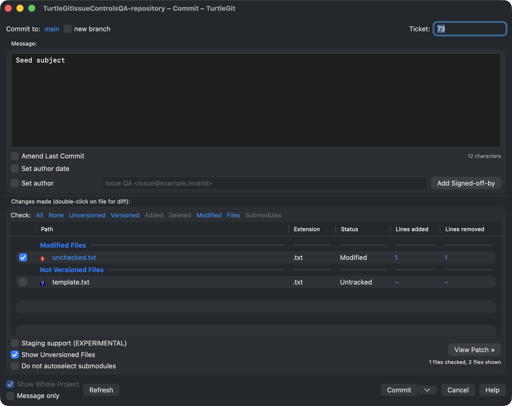
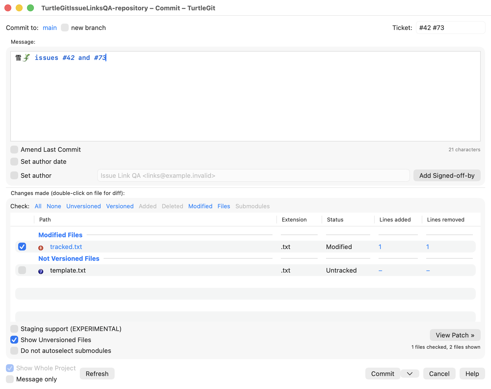
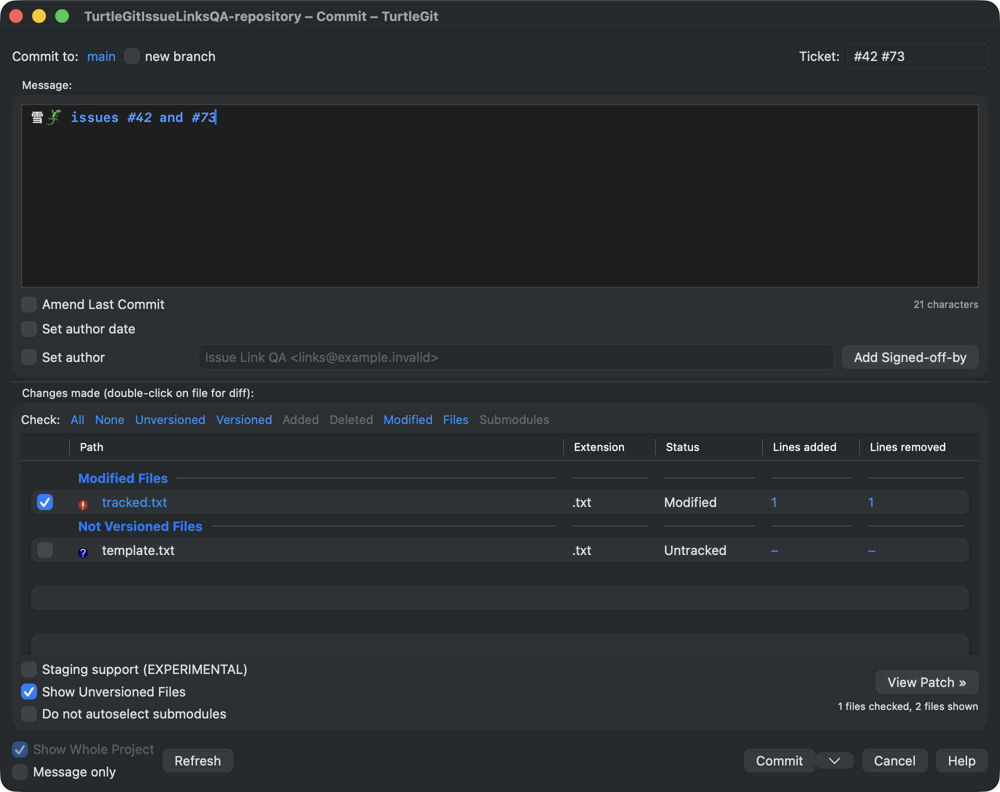
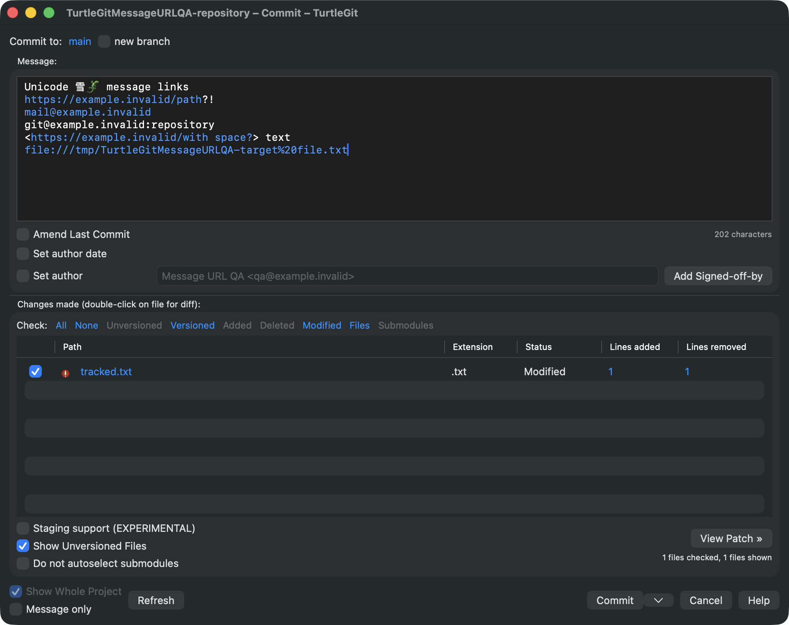

# Issue tracker integration audit

The pinned TortoiseGit baseline is
`7338078f8ddd924b8cddee35f512f2286072136d`. The audited files are
`src/TortoiseProc/ProjectProperties.cpp`, its header, and
`test/UnitTests/ProjectPropertiesTest.cpp`. Their Git blob hashes match the
repository inventory. The native Commit field, configuration loader, template
line handling and warning sequence are implemented, with broader integration
and signed sandbox acceptance still pending.
Build, process, source reconstruction and signing evidence is recorded in
[runtime acceptance](qa/issue-regex-runtime-2026-10-05.json).

## Matching engine

Upstream `FindBugIDPositions` uses C++ `std::wregex` with its default ECMAScript
grammar. One expression extracts capture group 1. Two expressions use the
complete second-expression matches inside each complete first-expression match.
A captureless first expression can satisfy `HasBugID` while extracting no IDs.
`HasBugID` searches only the first expression. UTF-16 character positions are
required by the Windows source and by native `NSString` ranges.

TurtleGit retains this C++ algorithm in `Sources/TurtleGitIssueRegex/main.cpp`.
macOS has 32-bit `wchar_t`, so the transport stores one UTF-16 code unit per
wide character. A private helper process receives three UTF-16LE files and
returns match presence and UTF-16 ranges. The Swift reader validates those
ranges. Inputs are argument arrays without a shell; diagnostic text is limited
to 1024 bytes. A shared runner bounds execution to five seconds plus a
one-second termination grace and forcibly reaps its own unresponsive process.
EditorConfig now uses the same runner. Excessive helper output is rejected.

The helper reports malformed expressions as an explicit failure. Upstream
silently catches compilation failures and may retain previously compiled
expressions. This error-state behavior is not yet mapped in the native property
loader. Matching grammar and UTF-16 positions are retained; libc++ versus MSVC
locale, character-class, pathological-expression and exception differences
still need cross-platform acceptance. No Foundation/ICU regex substitution is
used.

## Build and distribution

Run `python3 scripts/build-issue-regex-runtime.py` before Swift tests or a direct
Xcode build. CI and `scripts/build.sh` prepare it automatically. All Xcode
configurations embed `build/issue-regex-runtime/IssueRegex` at
`Contents/Helpers/IssueRegex`. The generated project includes the new Swift
reader and shared runner. The package contains the complete helper source,
GPL license, reconstruction and validation scripts, and source/binary hashes.
Only system dynamic libraries are linked; no Homebrew C++ runtime is required.

The validator checks both architecture slices and their macOS 13 load commands,
source correspondence, licenses and functional protocol examples. Add
`--all-architectures` to execute arm64 and x86_64 explicitly; Apple Silicon
requires Rosetta for the latter. This does not prove execution on an actual
Intel Mac or macOS 13 host.

AppStore signing applies only App Sandbox and sandbox inheritance to this
helper. Debug/Release use ordinary hardened-runtime signing. The unsigned
package is executed before signing; inherited sandbox signatures and
entitlements are inspected afterwards. Running an inherited helper directly
from unsandboxed Python does not prove signed app invocation and is skipped.
Debug preview signing updates both text-helper hashes and reseals the app.
Signed native App Store execution and scoped configuration access remain
unverified.

## Native Commit controls

`IssueTrackerProperties` reads Git's system/global/XDG values, overlays the
working tree's `.tgitconfig`, then overlays repository configuration. Native
Git worktree and command scopes remain higher priority on macOS. Includes use
Git's parser and relative file paths. A bare repository reads `HEAD:.tgitconfig`.
The configured label and issue field appear in the upper-right branch row, as
in the upstream resource at x=177/249, y=6/3; absent `bugtraq.message` hides them.
Initial issue focus and template-line extraction were verified in dark mode.

Numeric IDs accept only ASCII digits, commas and spaces. Template extraction
uses UTF-16 positions and trims only LF, including leaving CR from CRLF intact.
Message insertion trims the field, performs the upstream comma-space
replacement, avoids duplicate IDs and honors append/prepend. URL component
escaping is implemented and tested; native tracker links are described below.
Foundation supplies numeric comparison for natural ID ordering; full
`StrCmpLogicalW` locale/punctuation/equivalent-ID behavior is not proven.

Commit checks missing issue ID, exact unedited template, and missing identity
sign-off in that order. Each warning completes before committing or modifying
the index. Add Signed-off-by and the warning use the same identity and trailer
placement. Template comparison retains the upstream exact-text behavior:
extracting a template line trims trailing LF, which can change equality with
the original template. This source quirk is not normalized away.

Native No/Abort and numeric rejection retained HEAD and raw index bytes. A
real checked-file commit added the exact configured sign-off and `Refs: 42`
line, committed the latest selected contents, and preserved unchecked staged
and working versions. The field seeded `73` from a template and received
initial focus in dark mode. All QA apps were closed. Twenty-eight focused
Commit/issue/message tests and both unsigned app builds/resource audits passed.
See [control acceptance](qa/commit-issue-controls-2026-10-05.json).

## Message highlighting, links and history

`SciEdit.cpp` and its header were verified against inventory blobs
`5d221b688a02e72bf8b5ef0a9e260f9aa2a3fc7e` and
`0c26375d84d7d27b111a5759af820d9058da9b6e`. `MarkEnteredBugID` uses
narrow C++ ECMAScript regexes over UTF-8 bytes, unlike the UTF-16 validation
matcher. The bundled helper now retains that separate styling algorithm.
Single-expression capture 1 becomes the identifier; its preceding matched
context is bold. Two-expression matching styles complete inner matches and
surrounding context. Identifiers are bold italic hotspots. Adjacent equal
styles merge before resolving the link, matching Scintilla's contiguous style
scan. No simple-template styling fallback is invented.

AppKit maps complete UTF-8 scalar boundaries to UTF-16 attributed ranges,
using dynamic link colors and plain base typing attributes. Partial UTF-8
scalar ranges cannot be represented by AppKit and are omitted. Styling is
serialized off the main thread, debounced and canceled when superseded; stale
results do not replace newer text. Attribute updates preserve selection and
Undo registration. Native link activation follows the configured URL with
UTF-8 component escaping, and tooltips contain the resolved URL.

Recent messages matches `CommitDlg.cpp`'s prefix gate and updates a visible
issue field only when the chosen message yields nonempty IDs. A message with
no IDs retains the prior field. Pick commit message and ordinary typing only
insert text; they do not update the issue field. History matching uses the
wide validation algorithm, not the editor's byte matcher.

Native acceptance verified bold/italic ranges after Unicode prefixes, ordinary
link clicks opening the exact percent-escaped local QA target, retained Undo,
Recent-message field updates, no-ID retention, revision-picker retention and
removal of stale link attributes. Actual light and dark captures are below.
HEAD, raw index and working contents were unchanged. One QA app ran at a time;
all were closed after testing. See [recorded evidence](qa/commit-issue-links-2026-10-05.json).

Full-message native restyling does not yet reproduce every incremental
Scintilla anchor/styling state. Tracker providers, spell checking, snippets
and the remaining SciEdit functionality are pending. URL/email matching
is described below.
Signed inherited-helper invocation remains unverified. Native link dispatch
uses Apple's [NSTextView delegate](https://developer.apple.com/documentation/appkit/nstextviewdelegate/textview(_:clickedonlink:at:)).

## Ordinary URL and email links

The verified `src/Utils/URLFinder.h` blob is
`069cadee1eacb70a6d46ebeaf0933e76c8a3430d`. Its `FindURLMatches` scanner is
ported in `MessageURLFinder.swift`, using the same ASCII delimiter set,
trailing punctuation removal, angle-bracket mode and supported case-sensitive
prefixes: HTTP, HTTPS, Git, FTP, file and mailto (their lowercase spellings).
Email targets receive `mailto:`. Git SSH addresses containing a colon after
`@` are not email links. Bracketed URLs retain spaces and Unicode, with native
UTF-16 ranges advanced by complete scalars, matching SciEdit's byte traversal.
The scanner retains the upstream bracket-at-end-of-text quirk.

The Windows `PathIsURL` gate is adapted using scheme syntax before the original
prefix whitelist. Microsoft's [API documentation](https://learn.microsoft.com/en-us/windows/win32/api/shlwapi/nf-shlwapi-pathisurla)
describes URL-format testing but does not define every unusual scheme case.
Those cross-platform classification edge cases and non-ASCII CRT character
classification remain unverified; Foundation link guessing is disabled.

`SciEdit::StyleURLs` follows issue styling. Native composition therefore
splits issue runs at ordinary URL boundaries and resolves any remaining ID
hotspot from its actual visible substring. Ordinary links use the regular
font and dynamic link color; issue context and IDs keep bold/italic styles.
When issue matching fails during typing, ordinary links can still appear,
while Commit validation continues reporting configuration failures.

The upstream `AppUtilsTest.cpp` fixtures were verified at blob
`c2db167dc2893395ba497ba030d1a0e78b22bf6c`. Their complete URL range examples,
plus Unicode, punctuation, email/SSH gates and issue-style overlap tests pass.
Native acceptance without any tracker configuration verifies plain-font links,
Undo, removal of stale links, and a normal click opening the exact local file
with a percent-escaped space. HEAD, raw index and working contents remained
unchanged. The sole QA app quit normally; only its TextEdit QA document was
closed. See [URL acceptance](qa/commit-message-urls-2026-10-05.json).

## Remaining Commit behavior

- Validate XDG/system includes, conditional includes and scoped ancestor access
  in a signed app, and review CLI versus libgit2 precedence differences.
- Verify exact Windows natural ID ordering, incremental styling anchors, unusual
  Windows scheme classification, spell checking and other SciEdit editor behavior.
- Audit Windows tracker-provider plugins and define the macOS equivalent.
- Compare native light/dark Commit layouts and all controls with upstream;
  exercise scoped/signed builds, hooks, message-only and ReCommit/Push combinations.

See [Commit parity](COMMIT-PARITY.md) for the broader dialog audit. Original
source references are [ProjectProperties.cpp](https://github.com/TortoiseGit/TortoiseGit/blob/7338078f8ddd924b8cddee35f512f2286072136d/src/TortoiseProc/ProjectProperties.cpp)
and the [official integration manual](https://tortoisegit.org/docs/tortoisegit/tgit-dug-bugtracker.html).
